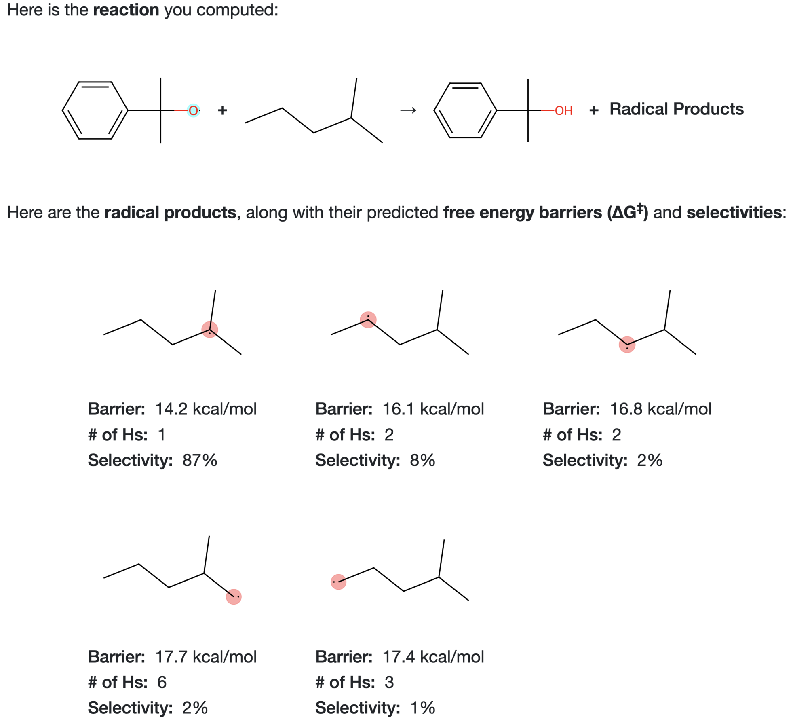

# HATPredict: Hydrogen Atom Transfer Product Predictor

### A·   +   B–H   →   A–H   +   B·

HATPredict is an open-source machine learning tool that predicts the **relative quantities of the products** formed in **hydrogen atom transfer (HAT)** reactions of the general form shown above.  It also outputs the **free energy barrier (∆G‡)** for the formation of each product.

To use the tool, simply navigate to [hatpredict.com](http://hatpredict.com) and go!  There is no need to install anything.  The site also contains an about page describing how HATPredict works and what scientific problem it is solving.

This github repository contains all of the source code for HATPredict, as well as a [Jupyter notebook](model/training/model_training.ipynb) which performs model training.

Here is an image of sample output from HATPredict.

  

